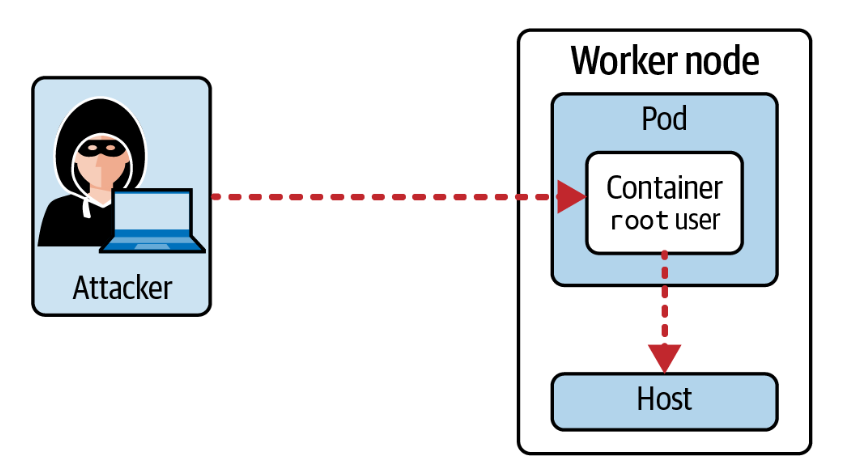

# Scenario: An Attacker Misuses root User Container Access 

By default, containers run with root privileges. A vulnerability in the application could grant an attacker root access to the container. The container’s root user is the same as the root user on the host machine. 

